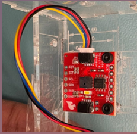

# Build instructions for AS7262 spectral sensor



The target audience is a CENG student from any post-secondary program that would like to recreate this project that adds an **AS7262 spectral light sensor** to the standard CENG 317 Raspberry Pi interface board, reads 6-channel visible-light spectra over I²C (address `0x49`), and streams live readings to Firebase for use in the Smart Assistive System Android app.

## Materials

[Order parts from Digikey](https://github.com/PrototypeZone/ceng317/blob/main/hardware/digikeyorder.md)  
[Order PCB](https://github.com/PrototypeZone/ceng317/tree/main/hardware/pcb)  
[Order plastic case](https://github.com/PrototypeZone/ceng317/tree/main/hardware/lasercutting)  

Additional parts used in this build:

- Raspberry Pi (any model with I²C support; tested on Raspberry Pi 4 with the CENG 317 course image)  
- CENG 317 Raspberry Pi HAT PCB and components from the standard kit:  
  - 40-pin stacking header for the Pi  
  - 2N3904 or 2N4124 NPN transistor  
  - 2.2 kΩ base resistor  
  - 220 Ω LED resistor  
  - 5 mm red LED  
  - Standoffs and M2.5 screws for mounting the HAT and case  
- **AS7262 spectral sensor** breakout board (visible-light version, I²C address `0x49`)  
- 1 × Qwiic cable or Qwiic-to-wires cable (3V3, GND, SDA, SCL)  
- USB-C or micro-USB power supply for Raspberry Pi  
- Micro-SD card with the CENG image (Raspberry Pi OS–based)  
- Acrylic case for mounting the HAT and sensor (laser-cut from the provided files)  
- Optional: extra standoffs / screws to mount the AS7262 board so it has a clear optical path for light  

Assembly steps:

1. Solder and inspect the CENG 317 Raspberry Pi HAT PCB following the course PCB design, including the **BJT switch + LED** (2N3904/2N4124, 2.2 kΩ base resistor, 220 Ω LED resistor).  
2. Solder a 4-pin **Qwiic connector** onto the HAT and wire it to 3V3, GND, SDA, and SCL as per the course wiring diagram.  
3. Mount the AS7262 breakout to the acrylic case using standoffs so that the sensor window is facing outward and exposed to ambient light.  
4. Connect the AS7262 to the HAT using the Qwiic cable (3V3 → 3V3, GND → GND, SDA → SDA, SCL → SCL).  
5. Mount the Pi + HAT into the acrylic case, making sure there is a clear cut-out / window for the AS7262.  
6. Connect the Raspberry Pi power supply and network as you normally do for CENG 317 labs.  

[Soldering](https://github.com/PrototypeZone/ceng317/blob/main/hardware/pcb/inspection.md)  
[Raspberrypi Image](https://github.com/PrototypeZone/ceng153/blob/main/image.md)  

## Software

### Required system packages

On Raspberry Pi OS (CENG course image), install/update these packages first:

- I²C tools and SMBus support  
  - `sudo apt update`  
  - `sudo apt install -y i2c-tools python3-smbus python3-pip`  

- Enable I²C interface  
  - `sudo raspi-config` → *Interface Options* → *I2C* → **Enable**  
  - Reboot the Pi.  

- Verify that the AS7262 sensor is detected at address `0x49`:  
  - `sudo i2cdetect -y 1`  
  - You should see `49` in the address table.

### Python libraries

From a terminal:

- `pip3 install smbus2`  
- `pip3 install firebase_admin` *(or the Firebase library used in your project)*  

Place the AS7262 script in the repository at:

- `hardware/AS7262/as7262.py`

To run the script:

```bash
cd ~/ceng317/hardware/AS7262
python3 as7262.py
