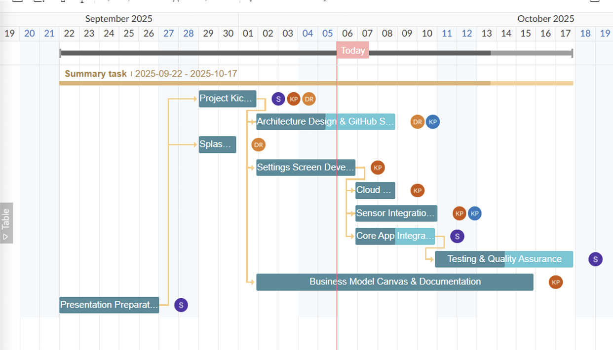

# CENG 355 SmartAssistiveSystem

## Declaration of Joint Authorship   
We, the undersigned, hereby declare that the work presented in the project “SmartAssistiveSmart: Sensor-Based Assistive Technology” is the result of joint collaboration among all listed authors. Each author has contributed significantly to the conception, design, implementation, and documentation of the project.

## Authors and Contributions

| Author Name       | Contribution                                                                   |
|------------------|---------------------------------------------------------------------------------|
| Krish Patel       | Hardware integration, App development, Sensor integration, Documentation       |
| Sarang Prajapati  | Hardware integration, Firebase setup, Sensor integration, Documentation        |
| Daksh Rana        | App development, Application ideas, Sensor testing, Presentation documentation |
| Kush Patel        | Research, Lab report, Expenditure tracking, Presentation documentation         |

All authors have read and approved the final version of the project and take full responsibility for the content and results presented. This work represents a collaborative effort, and all authors have contributed equally to its success. As this project is ongoing, the authorship and contributions may be updated in the future.

**Date:** [2026-01-28]  
**Signatures:**  
- Krish Patel  
- Kush Patel
- Sarang Prajapati
- Daksh Rana

[^1]: Technology Report Guidelines. OACETT, Revised September 2022. Available at: https://www.oacett.org/getmedia/5ad707d7-f472-4b24-a7fe-f34e270b0c41/2022_TR_Guidelines_-_Updated_Version_-_Sept_2022.pdf
## Proposal/Project Specifications   
[Link to proposal](wk01proposal.md).   
## Executive Summary
The Smart Assistive System is a portable sensor-based device that monitors environmental and user-specific parameters, sending real-time data to an Android app for monitoring and alerts. Using a Raspberry Pi as the main controller and Arduino microcontrollers for sensor interfacing, the system collects data from load cells, motion or proximity sensors, and other effectors. The app displays measurements, triggers notifications, and allows limited remote control of connected actuators.  

## Table of Contents

[Declaration of Joint Authorship](#declaration-of-joint-authorship)   
[Proposal/Project Specifications](#proposalproject-specifications)   
[Executive Summary](#executive-summary)   
[Table of Contents](#table-of-contents)   
[List of Figures](#list-of-figures)   

[1.0 Introduction](#10-introduction)   
[1.1 Background](#11-background)   
[1.2 Project Requirements and Specifications](#12-project-requirements-and-specifications)   
[1.3 Project Schedule](#13-project-schedule)   

[2.0 Hardware Development Platform Report/Build Instructions](#20-hardware-development-platform-reportbuild-instructions)  
[2.1 Krish Patel](#21-krish-patel)  
[2.2 Kush Patel](#22-kush-patel)  
[2.3 Daksh Rana](#23-daksh-rana)  
[2.4 Sarang Prajapati](#24-sarang-prajapati)

[3.0 Mobile Application Report](#30-mobile-application-report)  
[3.1 Deliverable 1](#31-deliverable-1)  
[3.2 Deliverable 2](#32-deliverable-2)  
[3.3 Deliverable 3](#33-deliverable-3) 
[3.4 Deliverable 4](#34-deliverable-4)  
[3.5 Deliverable 5](#35-deliverable-5)  

[4.0 Integration](#40-integration)  
[4.1 Enterprise Wireless Connectivity](#41-enterprise-wireless-connectivity)  
[4.2 Database Configuration](#42-database-configuration)  
[4.3 Network and Security Considerations](#43-network-and-security-considerations)  
[4.4 Unit Testing](#44-unit-testing)  
[4.5 Production Testing](#45-production-testing)  
[4.6 Sustainability Considerations](#46-sustainability-considerations)  
[4.7 Challenges/Problems](#47-challengesproblems)  
[4.8 Solutions](#48-solutions)  

[5.0 Results and Discussion](#50-results-and-discussion)

[6.0 Conclusions](#60-conclusions)

[7.0 Appendix](#70-appendix)  
[7.1 Firmware Code](#71-firmware-code)  
[7.2 Mobile Application Code](#72-mobile-application-code)  

[8.0 References](#80-references)  

## List of Figures   

## 1.0 Introduction   
### 1.1 Background   
### 1.2 Project Requirements and Specifications   
### 1.3 Project Schedule   
Insert Gantt Chart.     
###### Figure 1: Gantt Chart     

## 2.0 Hardware Development Platform Report/Build Instructions 

### 2.1 Krish Patel 
[Hardware Report - TSL2591](../hardware/TSL2591/tsl2591.md) 

### 2.2 Kush Patel 
[Hardware Report - VL53L1X](../hardware/vl53l1x.md)

### 2.3 Daksh Rana 
[Hardware Report - TCS34725](../hardware/tcs34725.md) 

### 2.4 Sarang Prajapati
[Hardware Report - AS7262](../hardware/AS7262/AS7262.md) 

## 3.0 Mobile Application Report

### 3.1 Deliverable 1
[Mobile Deliverable 1](../docs/Deliverable_1/Visionassistiveinovators_SmatAssisstiveSystem_05_Deliverable_1.pdf)

### 3.2 Deliverable 2
[Mobile Deliverable 2](../docs/Deliverable%202%20/Deliverable%202%20-%20SmartAssistiveSystem.pdf)

### 3.3 Deliverable 3
[Mobile Deliverable 3](../docs/Deliverable%203/VisionAssistInnovators_SmartAssistiveSystem_Group05_Deliverable3.pdf)

### 3.4 Deliverable 4
[Mobile Deliverable 4](../docs/Deliverable%204/Smart%20Assistive%20System%20-%20Deliverable%204.pdf)

### 3.5 Deliverable 5
[Mobile Deliverable 5](../docs/Deliverable%205/Smart%20Assistive%20System%20-%20Deliverable%205.pdf)

## 4.0 Integration   
### 4.1 Enterprise Wireless Connectivity   
### 4.2 Database Configuration   
### 4.3 Network and Security Considerations   
### 4.4 Unit Testing   
### 4.5 Production Testing   
### 4.6 Sustainability Considerations
### 4.7 Challenges/Problems   
### 4.8 Solutions   

## 5.0 Results and Discussion   

## 6.0 Conclusions   

## 7.0 Appendix
### 7.1 Firmware Code   
[Link to firmware](hardware/firmware).
### 7.2 Mobile Application Code   
[Link to GitHub repository for app]()

## 8.0 References   
