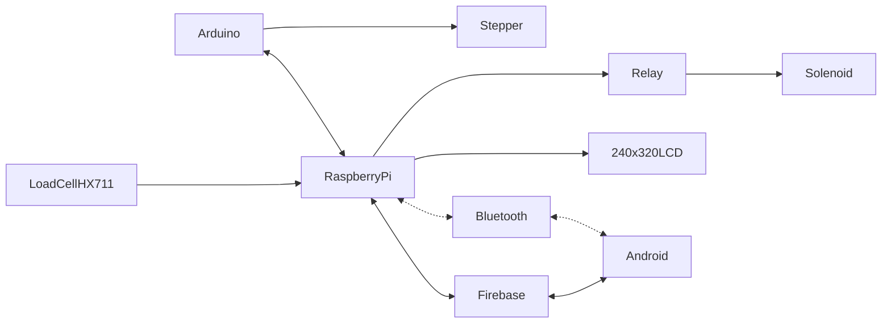

# Brief CENG Capstone Project Charter
-  [x] Select Project area:
1. [ ] :bike: Facilities: e.g. Bicycle Rental/Parking Lot/Vision System
2. [ ] :factory: Building Automation: e.g. Greenhouse/SolarPanel/Home
3. [ ] :movie_camera: Consumer: e.g. Entertainment Protocol DMX/Baby Monitoring Project
4. [ ] :mortar_board: Education: e.g. Robust Hackable Educational Project
5. [ ] :robot: Robotics: e.g. Control/Navigation/Dashboard
6. [x] :ski: Health and Wellness: e.g. Wearable
####  Project Title: 
Smart Assistive System
####  Executive Summary/Description of the Project (75 to 100 words): 
The Smart Assistive System is a portable sensor-based device that monitors environmental and user-specific parameters, sending real-time data to an Android app for monitoring and alerts. Using a Raspberry Pi as the main controller and Arduino microcontrollers for sensor interfacing, the system collects data from load cells, motion or proximity sensors, and other effectors. The app displays measurements, triggers notifications, and allows limited remote control of connected actuators. This setup supports both safety and independence for users, while providing caregivers with actionable insights, all within a compact and safe prototype enclosure.

####  Has this project been approved by all parties for posting (Y/N)?
-  [ ] Yes
-  [x] No

Optional Collaborator fields for sponsored projects

#### Sponsoring Industry and Personnel: 
#### Hours contributed: 
#### Number of full-time employees, year established, private or not-for-profit: 
#### Value of equipment or access to equipment provided: 
#### FAST contribution: 

####  List of Names of Students Involved in Project (first and last names and separate members by a comma):
Krish Patel , Kush Patel , Daksh Rana , Sarang Prajapati

####  Planned contact email for the [Expo submission form](https://appliedtechnology.humber.ca/shows/past-shows/advanced-manufacturing-projects/advanced-manufacturing-student-submission-form.html)
sarangprajapati9319@gmail.com

####  For each individual student state whether they have a complete parts kit, a multimeter, what development platform they have, what sensors/effectors they have along with system Requirements (List what sensors/effectors are to do), functionalty of prototype/describe any unsoldered connections.
Student A Name Krish Patel has:
- [x] Complete parts kit
- [ ] Multimeter
- Development platform: Broadcom single board computer
- Sensor/effector 1:
  - Device name: TSL2591
  - Product page (e.g. Sparkfun, Adafruit, etc.): Amazon.ca
  - Purchase page (e.g. DigiKey):Amazon.ca
  - I2C address:0x29
  - DEV_ID:N/A
  - Additional device specific components: Qwiic adaptor
  - Additional device specific connections in addition to or instead of Qwiic cable: None
  - Current hardware operational status: Working.

Student B Name Kush Patel has:
- [x] Complete parts kit
- [ ] Multimeter
- Development platform: Broadcom single board computer
- Sensor/effector 2:
  - Device name: VL53L1X
  - Product page (e.g. Sparkfun, Adafruit, etc.):
  - Purchase page (e.g. DigiKey):
  - I2C address:0x29
  - DEV_ID: N/A
  - Additional device specific components: None  
  - Additional device specific connections in addition to or instead of Qwiic cable: None
  - Current hardware operational status: Working 

Student C Name Daksh Rana has:
- [x] Complete parts kit
- [ ] Multimeter
- Development platform: Broadcom single board computer
- Sensor/effector 3:
  - Device name: TCS34725
  - Product page (e.g. Sparkfun, Adafruit, etc.):
  - Purchase page (e.g. DigiKey):
  - I2C address:0x29
  - DEV_ID:0x44
  - Additional device specific components: qwiic adapter
  - Additional device specific connections in addition to or instead of Qwiic cable:None
  - Current hardware operational status: Working

Student D Name Sarang Prajapati has:
- [x] Complete parts kit
- [ ] Multimeter
- Development platform: Broadcom single board computer
- Sensor/effector 4:
  - Device name:AS7262
  - Product page (e.g. Sparkfun, Adafruit, etc.):
  - Purchase page (e.g. DigiKey):
  - I2C address:0x49
  - DEV_ID:0x3E
  - Additional device specific components:None
  - Additional device specific connections in addition to or instead of Qwiic cable: None 
  - Current hardware operational status:Working

####  GitHub repository link(s):
[SmartAssistiveSystem](https://github.com/KushPatel7387/SmartAssistiveSystem)

####  Google Play App download link:
[No deployed](https://play.google.com/)

#### Hours per student:
$14\*3=42$ in class hours, $14\*3=42+$ outside of class.

#### Supervising Faculty: 
Kris Medri   

####  Hours per faculty: 
$14\frac{3}{20}\*3=6.3$ in class, $14\frac{1.05+1.49}{20}\*3=5.334+$ outside of class.

####  Scope:
Creation of a Prototype that is not to be left powered unattended. Keeping safety and Z462 in mind, the highest AC voltage that is to be used is 16Vrms from a wall adapter from which +/- 15V or as high as 45 VDC can be obtained. Maximum power consumption is to be 20 Watts. In alignment with the space below the tray in the Humber North Campus Electronics Parts kit the overall project maximum dimensions are 12 13/16" x 5 ¹/₂" x 2 ³/₄" = 32.5cm x 14cm x 7cm. If your PCB doesn’t work or you need to switch sensors/effectors, it is recommended that you use the SparkFun Qwiic system: https://www.sparkfun.com/products/15945

####  Design approach:

####  Mandate: 
Self funded (unless a sponsor has contractually agreed to contribute).
